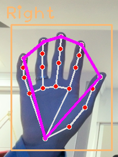

# Autores

- Allan Rodrigo Remedi Amantino
- Joao Vitor Silva Gomes
- João Arthur Z. Angnes
- João Lucas de Oliveira Vieira

# Detecção de Linguagem de Sinais usando Pontos de Referência - Python

- Neste projeto, o objetivo principal é criar um modelo que identifique as letras do alfabeto de sinais americano.

- Irá utilizar como dados as coordendas das landmarks da mão encontrada via webcam, tendo como referências os seguintes pontos:

- Mas para esse projeto, foi considerado apenas as distancias dos pontos das pontas dos dedos e o começo da mão, conforme as linhas em roxo do exemplo a seguir:

## Sobre o Dataset Utilizado

O dataset utilizado neste projeto é o 'American Sign Language', que foi obtido do site Kaggle. Você pode acessar o dataset através deste link: <https://www.kaggle.com/datasets/kapillondhe/american-sign-language/data>.

Este dataset é bastante extenso, contendo um arquivo de 4.98 GB. Ele é composto por 28 classes, que incluem:

- As letras do alfabeto de A até Z
- 'Nothing'
- 'Space'

Cada uma dessas classes contém, em média, 5.000 imagens. No entanto, para este projeto, optamos por utilizar apenas 600 imagens de cada classe. Além disso, decidimos não incluir a classe 'Nothing' em nosso modelo.

Desta forma, conseguimos um conjunto de dados mais gerenciável, sem comprometer a diversidade e a representatividade das classes de sinais de linguagem de sinais americanos.

## Criação de Dados Numéricos para Treinamento

Para transformar as imagens do dataset em dados numéricos que podem ser usados para treinar o modelo, foi desenvolvida uma estratégia implementada no script `CreateDataSet.py`.

Aqui está o que o script faz:

1. Ele percorre todas as imagens no diretório `./images`. Este diretório contém várias subpastas, cada uma representando uma classe diferente de sinal de linguagem de sinais.
2. Para cada imagem, o script extrai as características (landmarks) necessárias. Estas são as informações que o modelo usará para aprender a classificar os sinais.
3. As características extraídas são então armazenadas no arquivo `./data.pickle`, juntamente com o target correspondente. O target é a classe do sinal de linguagem de sinais que a imagem representa.

Desta forma, o script `CreateDataSet.py` transforma o conjunto de imagens em um conjunto de dados numéricos que pode ser usado para treinar o modelo de classificação.

## Pré Processamento dos Dados

O pré-processamento de dados é uma etapa crucial em qualquer projeto de aprendizado de máquina. Ele prepara os dados brutos para o treinamento do modelo, melhorando a eficácia e a eficiência do treinamento.

A normalização dos dados, como a realizada com o método MinMaxScaler neste projeto, é importante porque muitos algoritmos de aprendizado de máquina performam melhor quando os dados de entrada estão em uma escala similar. A normalização transforma todos os recursos para uma escala comum sem distorcer as diferenças nos intervalos de valores, garantindo que nenhum recurso tenha um peso indevido no modelo.

O balanceamento da base de dados é outra etapa importante do pré-processamento. Se a base de dados está desbalanceada, com algumas classes representadas mais do que outras, o modelo pode se tornar enviesado para as classes mais frequentes. No contexto deste projeto, o método SMOTE foi utilizado para balancear a base de dados. SMOTE é uma técnica de oversampling que gera novas instâncias da classe minoritária por meio de interpolação. Isso ajuda a garantir que o modelo treinado seja capaz de generalizar bem para todas as classes, não apenas para as mais frequentes.

## Método de Treinamento

O modelo escolhido a ser utilizado nessa base de teste será Random Forest.

O Random Forest é um algoritmo de aprendizado de máquina que utiliza múltiplas árvores de decisão durante o treinamento e produz a classe que é a moda das classes (classificação) ou a média das previsões individuais (regressão) das árvores. Ele é um método de ensemble, o que significa que combina as previsões de vários modelos para melhorar a robustez e a precisão da previsão.

No contexto deste projeto, o Random Forest foi escolhido para a classificação de imagens de linguagem de sinais por algumas razões.

Primeiro, ele é capaz de lidar com um grande número de recursos e identificar os mais importantes, o que é útil quando se trabalha com dados de imagens que podem ter muitos pontos de referência.

Segundo, ele é menos propenso a overfitting em comparação com outros algoritmos de aprendizado de máquina, devido à sua natureza de ensemble. Terceiro, ele é fácil de usar e fornece uma boa performance com parâmetros padrão, tornando-o uma escolha popular para muitos problemas de classificação.

## Hiperparametrização do Modelo

A hiperparametrização é uma etapa crucial no treinamento de modelos de aprendizado de máquina. Os hiperparâmetros são configurações que podem ser ajustadas antes do treinamento do modelo e que podem influenciar significativamente a performance do modelo. Ajustar corretamente os hiperparâmetros pode ajudar a evitar problemas como overfitting e underfitting.

O RandomizedSearchCV é uma técnica de otimização de hiperparâmetros que realiza uma busca aleatória nos hiperparâmetros do modelo para encontrar a melhor combinação. Ele é frequentemente preferido ao GridSearchCV, que realiza uma busca exaustiva, porque o RandomizedSearchCV pode ser mais eficiente: ele permite definir um número de iterações, reduzindo o tempo de computação.

No contexto deste projeto, o RandomizedSearchCV é usado para otimizar os hiperparâmetros do modelo Random Forest. Os hiperparâmetros que estão sendo otimizados incluem:

- 'n_estimators': o número de árvores na floresta.
- 'criterion': a função para medir a qualidade de uma divisão.
- 'min_samples_split': o número mínimo de amostras necessárias para dividir um nó interno.
- 'max_depth': a profundidade máxima da árvore.
- 'max_features': o número de recursos a considerar ao procurar a melhor divisão.
- 'random_state': usado para controlar a aleatoriedade do bootstrap das amostras usadas ao construir árvores.

## Cross Validation

O método de Cross Validation é utilizado para avaliar a capacidade de generalização de um modelo. Ele é especialmente útil para evitar o overfitting, que é quando o modelo se ajusta muito bem aos dados de treinamento, mas não consegue prever corretamente novos dados não vistos.

No Cross Validation, os dados são divididos em 'k' subconjuntos. Um dos subconjuntos é usado como dados de teste e o restante como dados de treinamento. O processo de treinamento e teste é repetido 'k' vezes, com cada subconjunto usado exatamente uma vez como dados de teste. A média dos resultados dos 'k' testes é então utilizada como a estimativa de desempenho do modelo.

No contexto deste projeto, o Cross Validation é usado para validar o modelo de classificação de imagens de linguagem de sinais treinado com o algoritmo Random Forest. Isso permite uma avaliação mais robusta do desempenho do modelo, uma vez que cada imagem é usada tanto para treinamento quanto para teste, garantindo que o modelo seja capaz de generalizar bem para novas imagens.

## Como Utilizar o Modelo Treinado

Para começar a usar o modelo de classificação de sinais de linguagem de sinais americanos que foi treinado, você precisa executar o arquivo `HandTracking.py`.

Este script fará o seguinte:

1. Acessará sua webcam para capturar vídeo em tempo real.
2. Começará a procurar por sinais de linguagem de sinais americanos no vídeo.
3. Para cada sinal detectado, o script extrairá as características (landmarks) da imagem. Essas características são então normalizadas para garantir a melhor performance do modelo.
4. O modelo treinado é então usado para classificar o sinal com base nas características normalizadas.
5. O resultado da classificação é exibido diretamente na tela, sobreposto à imagem da mão que está fazendo o sinal.

Desta forma, você pode ver em tempo real a interpretação que o modelo faz dos sinais de linguagem de sinais americanos que você está produzindo.

## Estrutura dos Arquivos

O repositório contém vários arquivos para treinamento do modelo de detecção. Aqui está um resumo das funcionalidades de cada arquivo:

`HandTrackingModule.py`

    - Este arquivo armazena todas as funções importantes para identificar os pontos de referência das mãos e parametrizar as bibliotecas utilizadas.
    - Serve como arquivo base para todo o projeto.

`HandTracking.py`

    - Esse arquivo é o responsável por executar a inferência do modelo de classificação em tempo real, utilizando a webcam do dispositivo. 
    - Utiliza as funções criadas no arquivo 'HandTrackingModule.py'

`CreateDataSet.py`

    - Este arquivo recupera todas as imagens coletadas e armazena os pontos de referência dos 20 pontos identificados pela biblioteca mediapipe em um arquivo 'pickle'.

`main.ipynb`

    - Este notebook Jupyter recebe os dados coletados, processa-os e treina um modelo para identificação.
    - Normalização dos dados
    - Balanceamento dos dados
    - Ajuste de hiperparâmetros: Utilizando o método RandomizedSearchCV
    - Modelo de Treinamento: RandomForestClassifier
    - Modelo de Validação: Cross Validate

    Após todas as validações, o modelo é salvo usando o pickle com o nome 'model.p'.

## Bibliotecas Utilizadas

- cv2
- HandTrackingModule
- Pickle
- Os

## Referências

<https://www.youtube.com/watch?v=wa2ARoUUdU8&t=12s&ab_channel=Murtaza%27sWorkshop-RoboticsandAI>
<https://www.youtube.com/watch?v=pDXdlXlaCco&ab_channel=NicholasRenotte>
<https://www.youtube.com/watch?v=MJCSjXepaAM&t=2947s&ab_channel=Computervisionengineer>
